# batdots

[](LICENSE)
[](https://www.kernel.org/)
[](http://makeapullrequest.com)

```txt
    __          __      __      __
   / /_  ____ _/ /_____/ /___  / /______
  / __ \/ __ `/ __/ __  / __ \/ __/ ___/
 / /_/ / /_/ / /_/ /_/ / /_/ / /_(__  )
/_.___/\__,_/\__/\__,_/\____/\__/____/
```

**Batdots** is a modular Linux bootstrap engine and dotfiles framework designed
for reliability, portability, and ease of maintenance.

## Why Batdots?

Managing dotfiles shouldn't just be about symlinking files. It should be about
**reproducible machine state**. Batdots treats your configuration as code,
allowing you to:

- **Centralize:** Keep all configs in one place, symlinked to their target
  locations.
- **Orchestrate:** Automate system tasks, package installation, and external
  builds.
- **Scale:** Use inheritance-based profiles to support different distros
  (Debian, Ubuntu, Arch) and machine types (Desktop, VM, Server).
- **Self-Heal:** Audit and repair machine drift with a built-in health checker.

## Architecture at a Glance

A single profile manifest drives a four-phase bootstrap; a built-in health check
keeps the machine in a known-good state afterwards.

```mermaid
flowchart LR
    P["Profile manifest<br/>manifests/&lt;profile&gt;.conf"]:::input
    O["bin/bootstrap.sh<br/>orchestrator"]:::core
    S["1 · System tasks"]:::phase
    K["2 · Packages"]:::phase
    X["3 · External builds"]:::phase
    L["4 · Symlinks"]:::phase
    M["Provisioned machine<br/>known-good state"]:::output

    P -->|loads| O
    O --> S --> K --> X --> L --> M

    classDef input fill:#eef2ff,stroke:#6366f1,color:#1e1b4b;
    classDef core fill:#1f2937,stroke:#111827,color:#f9fafb;
    classDef phase fill:#ecfeff,stroke:#0e7490,color:#083344;
    classDef output fill:#ecfdf5,stroke:#047857,color:#064e3b;
```



See the [architecture guide](docs/architecture.md) for the resolution model,
directory layout, and version registry.

## Getting Started

### 1. Prerequisites

Ensure you have `git` and `make` installed:

```bash
# Ubuntu/Debian
sudo apt update && sudo apt install -y git make

# Arch
sudo pacman -S git make
```

### 2. Initialization

Clone the repository and run the setup command to initialize your local
environment and secrets.

```bash
git clone https://github.com/el-amine-404/batdots.git ~/dotfiles
cd ~/dotfiles
make setup
```

**Note:** Review and edit the generated files in `local/` (e.g., `local/env.sh`)
before proceeding.

### 3. Provisioning

Apply a profile to your machine. The `desktop` profile is recommended for a full
workstation setup.

```bash
make bootstrap PROFILE=desktop
```

## Usage

`make help` lists every target with its description, sourced directly from the
`Makefile` -- the authoritative reference. The handful you'll reach for most:

- `make setup` -- initialize local config and secrets (run once,
  non-destructive).
- `make bootstrap PROFILE=desktop` -- provision the machine from a profile.
- `make doctor` / `make heal` -- audit machine drift, then auto-repair it.
- `make check-repo` -- run the full lint + syntax gate before committing.

Run `make help` for the complete, always-current list.

## Deep Dives

- [**Architecture**](docs/architecture.md): Bootstrap flow, resolution model,
  directory layout, and the version registry.
- [**User Script Catalog**](docs/scripts.md): Every command in `scripts/user/`,
  grouped by domain with a one-line description and source link.
- [**Engineering Guidelines**](docs/engineering-guidelines.md): House style,
  constraints, and contribution standards.
- [**Credits**](CREDITS.md): Attribution for third-party work and inspiration.

## License

MIT -- see [LICENSE](LICENSE).
