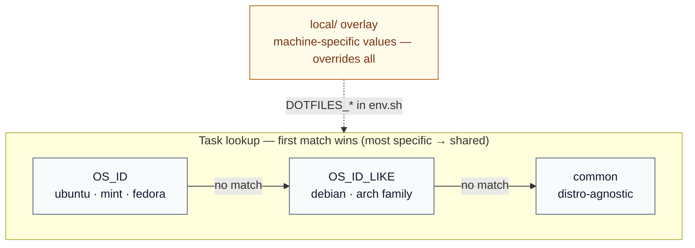

# System Architecture

Batdots provisions a machine from a single profile manifest in four ordered
phases, then keeps it in a known-good state with a self-check. This document
covers the **resolution model**, the **directory layout**, and the **version
registry**. The end-to-end bootstrap flow is summarized in the
[README](../README.md#architecture-at-a-glance).

## Resolution model

Tasks and configuration are layered from most generic to most specific. For any
task name, the runner walks the layers from the **most specific match down to
the shared default** and uses the first one that exists -- so a distro-specific
implementation transparently overrides the common one without the caller knowing
which layer answered.



`OS_ID` and `OS_ID_LIKE` come from `/etc/os-release` and are exported by
`bootstrap.sh`. Concretely, the task runner resolves
`scripts/tasks/<category>/<OS_ID>/<name>.sh`, then `<OS_ID_LIKE>/`, then
`common/`. Machine-specific values never live in tracked code: they are read
from `local/env.sh` as `DOTFILES_*` variables, which take precedence over
everything else.

## Directory layout

```text
.
├── apps/                   # the actual dotfiles for each application
├── assets/                 # repo assets, e.g. icons needed by some scripts
│   └── icons/
├── bin/                    # orchestrator layer
│   ├── bootstrap.sh        # provisioning entry point (runs the four phases)
│   ├── doctor.sh           # machine-state health check (--fix repairs symlinks)
│   ├── linker.sh           # applies symlink manifests
│   ├── packages.sh         # resolves + installs package groups
│   └── task.sh             # runs a system/external task by name
├── config/
│   ├── grub/
│   ├── package-managers/   # generic-name -> distro-specific package-name mappings
│   ├── packages/           # package lists per group (native, cargo, flatpak, ...)
│   ├── symlinks/           # source, destination and permissions per profile
│   └── versions.conf       # pinned version + source + probe per external tool
├── lib/                    # bash libraries; common helpers used across scripts
├── local/                  # sensitive data, not meant to be shared
├── manifests/              # the steps to run for each profile
└── scripts/
    ├── maintenance/        # scripts that manage this repo
    ├── tasks/
    │   ├── external/
    │   │   ├── common/     # build/install 3rd-party apps, distro-agnostic
    │   │   └── debian/     # build/install 3rd-party apps, Debian-specific
    │   └── system/
    │       ├── common/     # system tasks, distro-agnostic
    │       ├── debian/     # system tasks, Debian-specific
    │       └── ubuntu/     # system tasks, Ubuntu-specific
    └── user/               # personal automation commands (see the script catalog)
```

The personal commands under `scripts/user/` are documented in the
[User Script Catalog](scripts.md).

## How version resolution works

`config/versions.conf` is the single registry. Each component declares a TYPE
plus the data that type needs:

| TYPE            | Resolved via                                  | Extra fields                    |
| --------------- | --------------------------------------------- | ------------------------------- |
| `github`        | `git ls-remote --tags https://github.com/...` | `_REPO`, optional `_TAG_PREFIX` |
| `gitlab`        | `git ls-remote --tags` against `_SERVER`      | `_REPO`, `_SERVER`              |
| `bitbucket`     | `git ls-remote --tags`                        | `_REPO`                         |
| `googlestorage` | GCS JSON listing                              | `_BUCKET`, `_OBJ_PREFIX`        |
| `git`           | tracks a branch -- version is the branch name | `_URL`                          |
| `fixed` / `raw` | static -- value never changes                 | --                              |

Tag-sort rules: pre-releases (`rc`/`beta`/`alpha`/`pre`/...) are stripped,
dotted semver outranks opaque packed numerics, then `sort -V` decides.

Ghostscript uses a non-standard packed tag format (`gs10070` for 10.07.0). The
`_TAG_TRANSFORM="gs-packed"` flag opts a component into a dedicated fetcher that
converts every tag to dotted form before sorting. The conversion is public via
`source::gs_packed_to_dotted` / `source::gs_dotted_to_packed`. To add a new
component:

```bash
# In config/versions.conf
FOO_TYPE="github"
FOO_REPO="org/repo"
FOO_VERSION="0.0.0"          # cached fallback
FOO_PROBE="bin:foo"          # how package-status detects the installed copy
```

### Update the registry

1. Add it to `MEDIA_STACK_COMPONENTS`, `TOOL_COMPONENTS`, or `FONT_COMPONENTS`.
2. Then:

```bash
./scripts/maintenance/fetch-versions.sh
```

## Adding new things

**A package** -- add a line to `config/packages/<group>.txt`. Use
`name:flatpak`, `name:cargo` to override the native manager. If the name differs
across distros, add a row in `config/package-managers/<manager>.conf`:

```ini
generic_name = distro-specific-name
```

**A symlink** -- append to `config/symlinks/<set>.conf`:

```text
source-relative-to-repo | destination-relative-to-$HOME | octal-perms
apps/myapp              | .config/myapp                  | 0755
```

**A task** -- drop a script under `scripts/tasks/<category>/common/<name>.sh`
(or under a distro-specific folder if the implementation diverges). Reference it
by name in the profile's `SYSTEM_TASKS` or `EXTERNAL` array. The runner resolves
`OS_ID -> OS_ID_LIKE -> common` automatically.
